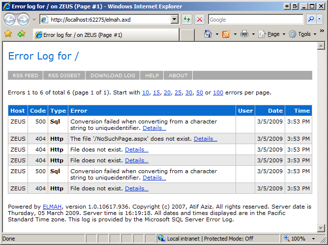
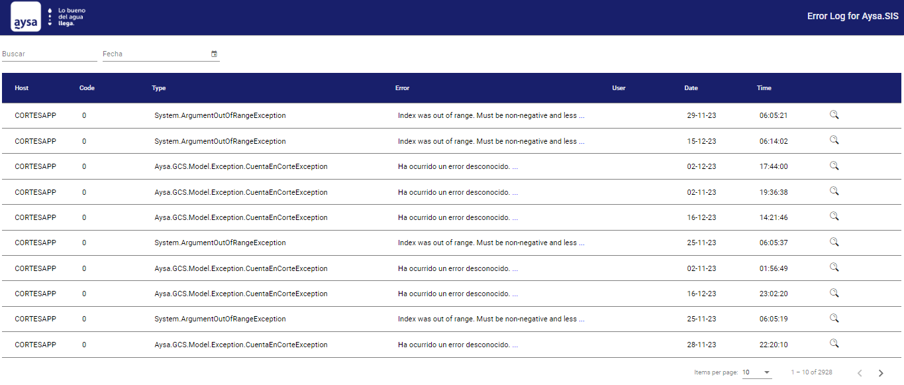
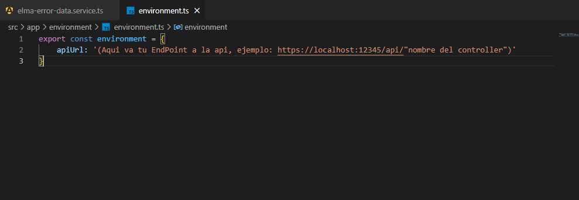
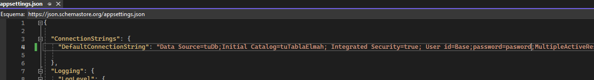

# Elmah Custom

## Introducción

Este proyecto representa una modernización y mejora de la interfaz de ELMAH (Error Logging Modules and Handlers), una popular biblioteca de registro de errores para aplicaciones web en .NET. ELMAH proporciona una forma sencilla de registrar errores no manejados en aplicaciones web, pero su interfaz de usuario por defecto puede resultar poco atractiva y no muy funcional.

Nuestra iniciativa se enfocó en transformar esta interfaz, manteniendo todas las funcionalidades de ELMAH, pero con un diseño más estético y amigable, y una mejor experiencia de usuario. Para ello, se creó una arquitectura dividida en dos partes: un back-end robusto desarrollado con C#, .NET y Visual Studio, y un front-end interactivo y moderno desarrollado con Angular, TypeScript, Bootstrap y Angular Material.

## Características Destacadas

- **Interfaz Moderna**: Rediseño completo del front-end para mejorar la usabilidad y estética.
- **Filtrado Eficaz de Errores**: Nuevas funcionalidades de filtrado para buscar errores específicos por texto y fecha.
- **Integración Profunda con la Base de Datos**: Adaptación del back-end para una gestión de errores más eficiente.

## Comparativa: Antes y Después

Visualiza el impacto de nuestra modernización en la interfaz de usuario de ELMAH. Las imágenes a continuación muestran la transformación lograda.

### Requisitos Previos

Para ejecutar este proyecto, necesitarás tener instaladas las siguientes herramientas y versiones:

- [Node.js](https://nodejs.org/): Versión 16.17.0 o superior
- [Angular CLI](https://angular.io/cli): Versión 15.1.6
- [npm](https://www.npmjs.com/): Versión 8.15.0 o superior

Además, el proyecto está desarrollado con las siguientes versiones de librerías y frameworks:

- [Angular](https://angular.io/): Versión 15.2.10
- [Angular CDK](https://material.angular.io/cdk/categories): Versión 14.2.7
- [Angular Material](https://material.angular.io/): Versión 14.2.7
- [RxJS](https://rxjs.dev/): Versión 7.8.1
- [TypeScript](https://www.typescriptlang.org/): Versión 4.9.5

Asegúrate de tener estas versiones (o versiones compatibles) instaladas para garantizar el correcto funcionamiento del proyecto.

### Instalación y Configuración

Pasos detallados para instalar y configurar el proyecto:

1. Clonar el repositorio: `git clone URL_DEL_REPOSITORIO`
2. Configurar el entorno de desarrollo siguiendo estas instrucciones: [Instrucciones Detalladas]
3. Compilar y ejecutar el proyecto localmente.

## Cómo Empezar
# 🌐 Proyecto ElmahErrors

Este proyecto contiene una aplicación web desarrollada con Angular y un backend en .NET. Aquí encontrarás las instrucciones para clonar el repositorio y configurar tanto el frontend como el backend.

## 🚀 Clonar el Repositorio

Para clonar el proyecto, utiliza el siguiente comando en tu terminal:
git clone https://code.aap.aysa.ad/DTI/GSU/AT/elmaherrors.git

## ⚙️ Configuración del Proyecto

El proyecto consta de dos partes principales: el frontend Angular en la carpeta `elmahWeb` y el backend .NET en la carpeta `elmaWebApi`.

### 🔧 Configuración del Backend

1. Navega a la carpeta `elmaWebApi`: cd elmaherrors/elmaWebApi
2. Abre la solución `ElmahWebApi.sln` en tu IDE preferido.
3. Asegúrate de tener instalados los siguientes paquetes NuGet:
- AutoMapper 12.0.1
- AutoMapper.Extensions.Microsoft.DependencyInjection 12.0.1
- Microsoft.EntityFrameworkCore 5.0.0
- Microsoft.EntityFrameworkCore.SqlServer 5.0.0
- Microsoft.EntityFrameworkCore.Design 5.0.0
- Microsoft.EntityFrameworkCore.Tools 5.0.0
- Swashbuckle.AspNetCore 5.6.3

Puedes instalarlos o actualizarlos a través del administrador de paquetes NuGet.

4. Ejecuta el proyecto para levantar el backend.

### 🌟 Configuración del Frontend

1. Navega a la carpeta `elmahWeb`: cd ../elmahWeb
2. Ejecuta `npm install` para instalar las dependencias del proyecto:
3. Una vez instaladas las dependencias, puedes iniciar el proyecto Angular con: ng serve
4. Abre tu navegador y ve a `http://localhost:4200` para ver la aplicación en funcionamiento.

### IMPORTANTE
- Modifica los siguientes archivos con datos de tu aplicación para poder observar los resultados.

## 📝 Notas Adicionales

- Asegúrate de tener el backend en ejecución antes de iniciar el frontend.
- Si encuentras problemas con las versiones de los paquetes, verifica que sean compatibles con tu entorno de desarrollo.

## 🚀 Uso y Navegación

Bienvenido a esta sencilla pero poderosa aplicación que utiliza una API para mostrar datos en una elegante grilla. A continuación, te presentamos una guía para aprovechar al máximo las características del proyecto:

### 1. Grilla de Datos 📊

La grilla de datos es el corazón de la aplicación y muestra información obtenida de la API. Puedes navegar a través de los datos de la siguiente manera:

- **Paginación** ➡️: Utiliza los botones "Anterior" y "Siguiente" para explorar diferentes páginas de datos. ¡Navegar nunca fue tan sencillo!

### 2. Búsqueda 🔍

Esta aplicación también te permite realizar búsquedas específicas para encontrar rápidamente la información que necesitas:

- **Búsqueda por Texto** 🔤: Utiliza el campo de búsqueda de texto para ingresar palabras clave y filtrar los datos en tiempo real. La grilla se actualizará automáticamente para mostrarte los resultados coincidentes.

- **Búsqueda por Fecha** 🗓️: Si deseas encontrar datos dentro de un rango de fechas específico, utiliza el campo de búsqueda de fecha para seleccionar las fechas deseadas. La grilla mostrará los registros correspondientes al período seleccionado.

### Ejemplos Prácticos 💡

A continuación, te presentamos algunos ejemplos prácticos para ayudarte a sacar el máximo provecho de estas características:

- Para encontrar todos los registros relacionados con un tema específico, simplemente ingresa las palabras clave en el campo de búsqueda de texto y observa cómo la grilla se actualiza al instante.

- Si necesitas ver los datos de un período específico, utiliza el campo de búsqueda de fecha para seleccionar las fechas deseadas y explora los resultados en la grilla.

- ¿Quieres ser aún más preciso? Combina el filtro de texto y el de fecha para encontrar información específica dentro de un rango de tiempo determinado.

